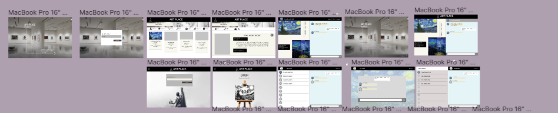
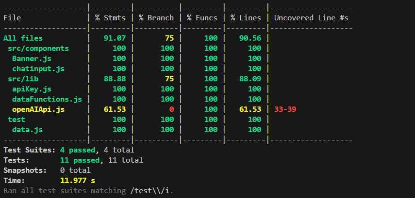

# Dataverse Chat

## Índice

- [1. Preámbulo](#1-preámbulo)
- [2. Resumen del proyecto](#2-resumen-del-proyecto)
- [3. Consideraciones generales](#3-consideraciones-generales)
- [4. Funcionalidades](#4-funcionalidades)
- [5. Consideraciones técnicas](#5-consideraciones-técnicas)
- [6. Hitos](#6-hitos)
- [7. Criterios de aceptación mínimos del proyecto](#7-criterios-de-aceptación-mínimos-del-proyecto)
- [8. Objetivos de aprendizaje](#8-objetivos-de-aprendizaje)
- [9. Pistas, tips y lecturas complementarias](#9-pistas-tips-y-lecturas-complementarias)
- [10. Consideraciones para pedir tu Project Feedback](#10-consideraciones-para-pedir-tu-project-feedback)

---

## 1. Preámbulo

En nuestro día a día, las aplicaciones web son como amigas
inseparables. Desde las redes sociales hasta las herramientas de
trabajo, las usamos todo el tiempo. Pero lo que hace que este
momento sea realmente especial es que estas aplicaciones nos pueden
abrir una puerta a algo asombroso: la interacción con inteligencia
artificial.

¿Qué tal si pudiéramos conversar con alguien que vivió hace más de
cien años o incluso con los personajes de nuestras series y
películas favoritas o con entidades que normalmente no pueden hablar
como por ejemplo planetas o animales? La inteligencia artificial nos
puede ayudar a entender el pasado y a conectarnos con figuras
históricas, así como a sumergirnos en mundos ficticios.


## 2. Resumen del proyecto

En este proyecto convertirás la aplicación desarrollada
en Dataverse en una
[Single Page Application (SPA)](https://es.wikipedia.org/wiki/Single-page_application),
manteniendo las funcionalidades de visualizar, filtrar, ordenar y
calcular alguna estadística, adicionando una nueva vista para
consultar información detallada de cada personaje/entidad y agregando
la posibilidad de interactuar con un personaje/entidad o todos ellos
a través de un sistema de chat impulsado por la
[API de OpenAI](https://openai.com/product).

### Los objetivos generales de este proyecto son los siguientes

- Desarrollar una [Single Page Application (SPA)](https://es.wikipedia.org/wiki/Single-page_application)
- Aplicar los conceptos de responsividad en el desarrollo de las vistas
- Implementar un router para la navegación entre las diferentes
  vistas de la aplicación
- Integrar una API externa
- Entender la asincronía en JavaScript
- Crear una suite de pruebas unitarias que permitan testear código asíncrono

## 3. Consideraciones generales

- Este proyecto se debe resolver en duplas.

- El rango de tiempo estimado para completar el proyecto es de 4 a 5 Sprints.

- La lógica del proyecto debe estar implementada completamente en JavaScript
  (ES6+), HTML y CSS. Para este proyecto **no está permitido** utilizar
  _frameworks_ o librerías de CSS y JS.

- Reutilizar cierta parte del código del proyecto Dataverse, sobre todo el dataset.
  Además debes refactorizar el código para que sea más modular y reutilizable
  implementando nuevas funciones para lograr las funcionalidades requeridas
  en este proyecto.

- El proyecto será entregado subiendo tu código a GitHub (commit/push) y la
  interfaz será desplegada usando cualquiera de estas opciones:
  [Vercel](https://vercel.com/) o [Netlify](https://www.netlify.com/).

- La división y organización del trabajo debe permitir, sin excepciones, que
  **cada integrante** del equipo practique el aprendizaje de todo lo involucrado
  en **cada historia**. _No se dividan el trabajo como en una fábrica._
  - ¿Hasta acá has avanzado en tus proyectos con cierta fluidez y sin mayores
    problemas? Sé generosa con tus compañeras, permíteles aprender y practicar
    sin restricciones, aunque tome un poco más de tiempo. Aprovecha de
    _coachearlas_, de hacer _pair programming_, una de las mejores maneras de
    aprender es explicando verbalmente.
  - ¿Se te está haciendo difícil y te cuesta un poco más avanzar? No te quedes
    con las partes "fáciles" del proyecto, conversa, negocia, exige tu oportunidad
    para practicar y aprender lo que se te hace más difícil.
    Para comenzar tendrás que hacer un _fork_ y _clonar_ este repositorio.

## 4. Funcionalidades

Como entregable final tendrás una Single Page Application (SPA) que permita,
además de **visualizar la data, filtrarla, ordenarla y calcular alguna
estadística** tal como se hizo en Dataverse, acceder a una página de detalle
de cada personaje y poder _interactuar_ con
los personajes o entidades del set de data que utilizaste anteriormente.

Aquí definimos en más detalle las funcionalidades mínimas que debe tener:

- La aplicación debe ser _responsive_
- La aplicación debe ser una SPA con múltiples vistas:
  - Implementar un sistema de enrutamiento que permita la navegación
    dentro de la aplicación.
  - Cada vista de la aplicación debe ser cargada dinámicamente
    mediante JavaScript.
  - Asegurarse de que la URL se actualice de manera acorde a la vista
    cargada al igual que el `title` del documento (la pestaña del navegador).
  - La aplicación debe ser capaz de cargar la vista correspondiente a
    la URL actual al iniciar la aplicación.
- La aplicación debe mantener las funcionalidades de Dataverse: visualizar,
  filtrar, ordenar y calcular estadística de la data.
- Al hacer clic en una tarjeta de personaje/entidad, la aplicación debe
  redirigirse a una vista **con su propia URL** que muestre la información
  detallada sobre ese personaje/entidad en particular
- La aplicación debe permitir a la usuaria configurar la API Key para
  interactuar con la API de Open AI
- Usando la API de Open AI, la aplicación debe permitir al usuario
  interactuar con un personaje/entidad a través de un chat.
  Por ejemplo, si usamos la data de ejemplo de Dataverse, correspondiente
  a las mujeres con mayores contribuciones a la programación en la historia,
  una usuaria puede establecer una conversación
  interactiva con
  [Ada Lovelace](https://es.wikipedia.org/wiki/Ada_Lovelace)
  a través del sistema de chat, obteniendo
  información sobre sus logros, desafíos y contribuciones a la informática.
  La inteligencia artificial de OpenAI permite que las respuestas sean
  informativas y personalizadas según las preguntas de los usuarios.

```text
Usuaria: "Hola, Ada. Cuéntame más sobre tus contribuciones a la informática."

Ada Lovelace (AI de OpenAI): "¡Hola! Claro, estaré encantada de hablar sobre eso.
Mis contribuciones más destacadas se relacionan con el trabajo junto a Charles Babbage
en el diseño de la Máquina Analítica. Además, desarrollé el primer algoritmo destinado
a ser procesado por una máquina, lo que me convierte en la primera programadora de la historia.
¿Hay algo más en particular que te gustaría saber?"

Usuaria: "¡Eso es fascinante! ¿Qué desafíos enfrentaste en ese tiempo?"

Ada Lovelace (AI de OpenAI): "En ese tiempo, enfrenté varios desafíos, uno de los
principales fue la limitación de recursos y la falta de reconocimiento del potencial
de la Máquina Analítica. También tuve que superar las restricciones sociales de
la época, ya que las mujeres tenían un acceso limitado a la educación en
matemáticas y ciencias. Sin embargo, mi pasión por la matemática y la visión
de lo que estas máquinas podrían lograr me impulsaron a seguir adelante."
```

- La aplicación debe permitir al usuario interactuar de manera simultánea
  con **todos** los personajes/entidades a través de un chat:
  - Esta funcionalidad debe cargarse en la URL `/panel`
  - La usuaria puede ingresar su pregunta o mensaje para todos los
    personajes/entidades en un cuadro de texto y enviarlo con un botón
  - El mensaje de la usuaria debe ser ajustado para cada personaje/entidad,
    con el objetivo que este genere una respuesta basada en su personalidad
    y conocimiento
  - Las respuestas de todos los personajes se muestran de acuerdo al orden
    respuesta.
  - Indicar visualmente cuando uno o varios personajes/entidades esten
    generando una respuesta al mensaje enviado
- La aplicación debe informar a la usuaria los errores que puedan surgir al
  interactuar con la API, como por ejemplo alcanzar la cuota de tokens por
  minuto o cualquier otro error relacionado con la API. Debería
  proporcionarse una descripción clara de la causa del problema y posibles
  soluciones.

Para que los chats anteriores puedan funcionar, es esencial que la aplicación
se integre con la IA a través de la API de OpenAI. Para ello, el equipo de
Laboratoria te proporcionará una API Key que la usuaria deberá poder ingresar
en la aplicación que tu construirás.

_Nota_: puedes revisar esta [implementación](https://laboratoria-dataverse-talks.netlify.app/)
de ejemplo, cuyo principal objetivo es mostrarte cómo se vería la
funcionalidad de chat en tu aplicación, más no tomes el diseño como
referencia para tu proyecto, siente libre de hacer volar tu imaginación
diseñando tu propia interfaz.

## 5. Consideraciones técnicas

La lógica del proyecto debe estar implementada completamente en JavaScript
(ES6), HTML y CSS. En este proyecto NO está permitido usar librerías o
frameworks, solo [vanilla JavaScript](https://medium.com/laboratoria-how-to/vanillajs-vs-jquery-31e623bbd46e).

El _boilerplate_ que viene con el proyecto es una estructura inicial. Ustedes
deben ir agregando más archivos conforme vayan avanzando en su proyecto.
La siguiente es una estructura de archivos que recomendamos:

```text
.
├── src
|  ├── components
|  ├── data
|  |  └── dataset.js
|  ├── lib
|  |  └── dataFunctions.js
|  ├── views
|  ├── index.html
|  ├── index.js
|  ├── router.js
|  └── style.css
├── test
|  └── dataFunctions.spec.js
|  └── example.spec.js
├── README.md
└── package.json

```

### `src/components`

Esta carpeta contendrá archivos JavaScript
que representan [componentes](https://lenguajejs.com/vuejs/componentes/que-es-un-componente/)
reutilizables de tu aplicación. Estos componentes
pueden ser elementos de la interfaz de usuario que se utilizan en varias partes
de tu aplicación. Organizar tus componentes de esta manera ayuda a mantener un
código más modular y reutilizable.

### `src/data`

En esta carpeta están los datos con los que vas a trabajar (los datos de ejemplo
o los datos que generarías con ayuda de la inteligencia artificial).

### `src/lib`

En esta carpeta, crearás módulos que contengan funcionalidades no relacionadas
al DOM. Aquí podrás incluir el archivo
`dataFunctions.js` que contiene las funciones que te permiten filtrar,
ordenar y hacer cálculos agregados. También podrás crear archivos con
las funciones que
interactúen con la API de inteligencia artificial o utilidades destinadas
a almacenar datos en el local storage.

### `src/views`

Esta carpeta generalmente contiene archivos de los componentes que
representan las diferentes páginas o vistas de tu aplicación.
Cada vista (view) puede tener su propio archivo
JavaScript, que exporta una función que es responsable de generar
los elementos del DOM.

### `src/index.html`

Como en el proyecto anterior, existe un archivo `index.html`. En este archivo
HTML encontrarás un elemento DOM `<div id='root'></div>` donde vas a
renderizar las diferentes vistas de tu aplicación.

### `src/index.js`

El punto de partida para tu SPA sera el archivo `src/index.js`. Acá encontrarás
algunas instrucciones y comentarios para guiarte en el inicio del desarrollo
de tu aplicación.

### `src/router.js`

En este archivo vas a manejar el enrutamiento de tu aplicación. Es un archivo
que debes crearlo por tu cuenta.

### `src/style.css`

Es un archivo que debes crearlo por tu cuenta para agregar los estilos que
necesites para tu aplicación.

### `src/test`

Esta carpeta contiene los tests de tus funciones y componentes. Por ejemplo
los tests de dataFunctions deben estar aquí.

## 6. Hitos

Para resolver un problema,
es importante comprenderlo en profundidad.
Una forma de hacerlo es descomponerlo en problemas más pequeños.
Esto nos ayudará a identificar las causas del problema y
a desarrollar soluciones más efectivas.

En este proyecto, te sugerimos que trabajes por hitos.
Esto te permitirá enfocarte en un problema a la vez y
hacer un seguimiento de tu progreso.
A continuación, te presentamos un cronograma de hitos que
te puede ayudar a organizar tu trabajo.

- [Hito 1](./docs/01-milestone.md)
- [Hito 2](./docs/02-milestone.md)
- [Hito 3](./docs/03-milestone.md)
- [Hito 4](./docs/04-milestone.md)
- [Hito 5](./docs/05-milestone.md)

## 7. Criterios de aceptación mínimos del proyecto

Además de las funcionalidades que definimos en la sección de
[Funcionalidades](#4-funcionalidades), tu proyecto debe cumplir con los
siguientes requisitos:

### Definición del producto

Chat de una Galería de Obras de arte

Necesidades de los usuarios
Los usuarios quieren una página donde puedan chatear con las obras de arte con el fin de conocer más detalles sobre la pintura.

### Historias de usuaria

Se crearon las historias de usuario para ir trabajando por sprint. Ejemplo de la una historia de usuario:
Historia 3
Como persona interesada en el arte
Quiero poder chatear con las obras de arte (individualmente).
Para (beneficio): solventar mas dudas o saber mas detalles.

Criterios de aceptación
-Escribir un mensaje y obtener una respuesta.

Definición de hecho

Que el API acepte la llave y se conecte con la IA
Obtener respuestas con sentido*(personificacion)*.
Que los elementos del chat se adecuen segun la interacción*(nubes de chat, el icono de obra, el input de chat)*.

### Diseño de la Interfaz de Usuaria

#### Prototipo de baja fidelidad

Trabajamos directamente en el prototipo del Dataverse y realizamos los ajustes para esta nueva funcionalidad del chat.

#### Prototipo de alta fidelidad

El prototipo fue creado en Figma tanto para teléfonos móviles como para desktop.


### Testeos de usabilidad

Durante los tests de usabilidad los usuarios nos comentaron sobre el diseño del menú. También recibimos feedback con respecto a la navegación entre las páginas por lo que agregamos algunas nuevas rutas para moverse del chat individual al grupal directamente y para regresar del registro del Api en caso de que el usuario decida no usar esa funcionalidad.

### Pruebas unitarias

Las pruebas unitarias se realizaron obteniendo el siguiente resultado:


## 8. Objetivos de aprendizaje

Reflexiona y luego marca los objetivos que has llegado a entender y aplicar en tu proyecto. Piensa en eso al decidir tu estrategia de trabajo.

### HTML


- [X] **Uso de HTML semántico**


    <details><summary>Links</summary><p>

  - [HTML semántico](https://curriculum.laboratoria.la/es/topics/html/html5/semantic-html)
  - [Semantics - MDN Web Docs Glossary](https://developer.mozilla.org/en-US/docs/Glossary/Semantics#Semantics_in_HTML)
  </p></details>

### CSS


- [X] **Uso de selectores de CSS**


    <details><summary>Links</summary><p>

  - [Intro a CSS](https://curriculum.laboratoria.la/es/topics/css/css/intro-css)
  - [CSS Selectors - MDN](https://developer.mozilla.org/es/docs/Web/CSS/CSS_Selectors)
  </p></details>

- [X] **Modelo de caja (box model): borde, margen, padding**


    <details><summary>Links</summary><p>

  - [Box Model & Display](https://curriculum.laboratoria.la/es/topics/css/css/boxmodel-and-display)
  - [The box model - MDN](https://developer.mozilla.org/en-US/docs/Learn/CSS/Building_blocks/The_box_model)
  - [Introduction to the CSS box model - MDN](https://developer.mozilla.org/en-US/docs/Web/CSS/CSS_Box_Model/Introduction_to_the_CSS_box_model)
  - [CSS display - MDN](https://developer.mozilla.org/pt-BR/docs/Web/CSS/display)
  - [display - CSS Tricks](https://css-tricks.com/almanac/properties/d/display/)
  </p></details>

- [X] **Uso de flexbox en CSS**


    <details><summary>Links</summary><p>

  - [A Complete Guide to Flexbox - CSS Tricks](https://css-tricks.com/snippets/css/a-guide-to-flexbox/)
  - [Flexbox Froggy](https://flexboxfroggy.com/#es)
  - [Flexbox - MDN](https://developer.mozilla.org/en-US/docs/Learn/CSS/CSS_layout/Flexbox)
  </p></details>

- [x] **Uso de CSS Grid Layout**

    <details><summary>Links</summary><p>

  - [A Complete Guide to Grid - CSS Tricks](https://css-tricks.com/snippets/css/complete-guide-grid/)
  - [Grids - MDN](https://developer.mozilla.org/en-US/docs/Learn/CSS/CSS_layout/Grids)
  </p></details>

### Web APIs


- [X] **Ruteado (History API, evento hashchange, window.location)**


    <details><summary>Links</summary><p>

  - [Manipulando el historial del navegador - MDN](https://developer.mozilla.org/es/docs/DOM/Manipulando_el_historial_del_navegador)
  </p></details>

- [X] **Browser storage (localStorage, sessionStorage)**


    <details><summary>Links</summary><p>

  - [Window.localStorage - MDN](https://developer.mozilla.org/es/docs/Web/API/Window/localStorage)
  </p></details>


- [X] **Fetch API**


    <details><summary>Links</summary><p>

  - [Fetch API - MDN](https://developer.mozilla.org/es/docs/Web/API/Fetch_API)
  </p></details>

#### DOM (Document Object Model)


- [X] **Uso de selectores del DOM**


    <details><summary>Links</summary><p>

  - [Manipulación del DOM](https://curriculum.laboratoria.la/es/topics/browser/dom/1-dom-methods-selection)
  - [Introducción al DOM - MDN](https://developer.mozilla.org/es/docs/Web/API/Document_Object_Model/Introduction)
  - [Localizando elementos DOM usando selectores - MDN](https://developer.mozilla.org/es/docs/Web/API/Document_object_model/Locating_DOM_elements_using_selectors)
  </p></details>

- [X] **Manejo de eventos del DOM (listeners, propagación, delegación)**


    <details><summary>Links</summary><p>

  - [Introducción a eventos - MDN](https://developer.mozilla.org/es/docs/Learn/JavaScript/Building_blocks/Events)
  - [EventTarget.addEventListener() - MDN](https://developer.mozilla.org/es/docs/Web/API/EventTarget/addEventListener)
  - [EventTarget.removeEventListener() - MDN](https://developer.mozilla.org/es/docs/Web/API/EventTarget/removeEventListener)
  - [El objeto Event](https://developer.mozilla.org/es/docs/Web/API/Event)
  </p></details>


- [X] **Manipulación dinámica del DOM**


    <details><summary>Links</summary><p>

  - [Introducción al DOM](https://developer.mozilla.org/es/docs/Web/API/Document_Object_Model/Introduction)
  - [Node.appendChild() - MDN](https://developer.mozilla.org/es/docs/Web/API/Node/appendChild)
  - [Document.createElement() - MDN](https://developer.mozilla.org/es/docs/Web/API/Document/createElement)
  - [Document.createTextNode()](https://developer.mozilla.org/es/docs/Web/API/Document/createTextNode)
  - [Element.innerHTML - MDN](https://developer.mozilla.org/es/docs/Web/API/Element/innerHTML)
  - [Node.textContent - MDN](https://developer.mozilla.org/es/docs/Web/API/Node/textContent)
  </p></details>

### JavaScript


- [X] **Uso de identificadores descriptivos (Nomenclatura y Semántica)**

- [X] **Variables (declaración, asignación, ámbito)**


    <details><summary>Links</summary><p>

  - [Valores, tipos de datos y operadores](https://curriculum.laboratoria.la/es/topics/javascript/basics/values-variables-and-types)
  - [Variables](https://curriculum.laboratoria.la/es/topics/javascript/basics/variables)
  </p></details>

- [X] **Funciones (params, args, return)**


    <details><summary>Links</summary><p>

  - [Funciones (control de flujo)](https://curriculum.laboratoria.la/es/topics/javascript/flow-control/functions)
  - [Funciones clásicas](https://curriculum.laboratoria.la/es/topics/javascript/functions/classic)
  - [Arrow Functions](https://curriculum.laboratoria.la/es/topics/javascript/functions/arrow)
  - [Funciones — bloques de código reutilizables - MDN](https://developer.mozilla.org/es/docs/Learn/JavaScript/Building_blocks/Functions)
  </p></details>


- [X] **Uso de condicionales (if-else, switch, operador ternario, lógica booleana)**


    <details><summary>Links</summary><p>

  - [Estructuras condicionales y repetitivas](https://curriculum.laboratoria.la/es/topics/javascript/flow-control/conditionals-and-loops)
  - [Tomando decisiones en tu código — condicionales - MDN](https://developer.mozilla.org/es/docs/Learn/JavaScript/Building_blocks/conditionals)
  </p></details>


- [X] **Diferenciar entre expresiones (expressions) y sentencias (statements)**

- [X] **Uso de bucles/ciclos (while, for, for..of)**


    <details><summary>Links</summary><p>

  - [Bucles (Loops)](https://curriculum.laboratoria.la/es/topics/javascript/flow-control/loops)
  - [Bucles e iteración - MDN](https://developer.mozilla.org/es/docs/Web/JavaScript/Guide/Loops_and_iteration)
  </p></details>

#### Asincronía

- [X] **Callbacks**

    <details><summary>Links</summary><p>

  - [Función Callback - MDN](https://developer.mozilla.org/es/docs/Glossary/Callback_function)
  </p></details>


- [X] **Promesas**


    <details><summary>Links</summary><p>

  - [Promise - MDN](https://developer.mozilla.org/es/docs/Web/JavaScript/Reference/Global_Objects/Promise)
  - [How to Write a JavaScript Promise - freecodecamp (en inglés)](https://www.freecodecamp.org/news/how-to-write-a-javascript-promise-4ed8d44292b8/)
  </p></details>

#### Tipos de datos


- [X] **Diferenciar entre tipos de datos primitivos y no primitivos**

- [X] **Arrays (arreglos)**


    <details><summary>Links</summary><p>

  - [Arreglos](https://curriculum.laboratoria.la/es/topics/javascript/arrays)
  - [Array - MDN](https://developer.mozilla.org/es/docs/Web/JavaScript/Reference/Global_Objects/Array/)
  - [Array.prototype.sort() - MDN](https://developer.mozilla.org/es/docs/Web/JavaScript/Reference/Global_Objects/Array/sort)
  - [Array.prototype.forEach() - MDN](https://developer.mozilla.org/es/docs/Web/JavaScript/Reference/Global_Objects/Array/forEach)
  - [Array.prototype.map() - MDN](https://developer.mozilla.org/es/docs/Web/JavaScript/Reference/Global_Objects/Array/map)
  - [Array.prototype.filter() - MDN](https://developer.mozilla.org/es/docs/Web/JavaScript/Reference/Global_Objects/Array/filter)
  - [Array.prototype.reduce() - MDN](https://developer.mozilla.org/es/docs/Web/JavaScript/Reference/Global_Objects/Array/Reduce)
  </p></details>


- [X] **Objetos (key, value)**

    <details><summary>Links</summary><p>

  - [Objetos en JavaScript](https://curriculum.laboratoria.la/es/topics/javascript/objects/objects)
  </p></details>

#### Módulos

- [X] **Módulos de ECMAScript (ES Modules)**

    <details><summary>Links</summary><p>

  - [import - MDN](https://developer.mozilla.org/es/docs/Web/JavaScript/Reference/Statements/import)
  - [export - MDN](https://developer.mozilla.org/es/docs/Web/JavaScript/Reference/Statements/export)
  </p></details>

#### Testing en Javascript


- [X] **Pruebas unitarias (unit tests)**


    <details><summary>Links</summary><p>

  - [Empezando con Jest - Documentación oficial](https://jestjs.io/docs/es-ES/getting-started)
  </p></details>

- [x] **Pruebas asíncronas**

    <details><summary>Links</summary><p>

  - [Tests de código asincrónico con Jest - Documentación oficial](https://jestjs.io/docs/es-ES/asynchronous)
  </p></details>


- [X] **Uso de mocks y espías**


    <details><summary>Links</summary><p>

  - [Manual Mocks con Jest - Documentación oficial](https://jestjs.io/docs/es-ES/manual-mocks)
  </p></details>

### HTTP

- [x] **Cabeceras (headers)**

    <details><summary>Links</summary><p>

  - [HTTP headers - MDN](https://developer.mozilla.org/es/docs/Web/HTTP/Headers)
  </p></details>


- [X] **Consulta o petición (request) y respuesta (response).**


    <details><summary>Links</summary><p>

  - [Generalidades del protocolo HTTP - MDN](https://developer.mozilla.org/es/docs/Web/HTTP/Overview)
  - [Mensajes HTTP - MDN](https://developer.mozilla.org/es/docs/Web/HTTP/Messages)
  </p></details>


- [X] **Códigos de status de HTTP**


    <details><summary>Links</summary><p>

  - [Códigos de estado de respuesta HTTP - MDN](https://developer.mozilla.org/es/docs/Web/HTTP/Status)
  - [The Complete Guide to Status Codes for Meaningful ReST APIs - dev.to](https://dev.to/khaosdoctor/the-complete-guide-to-status-codes-for-meaningful-rest-apis-1-5c5)
  </p></details>

### AI Prompting


- [X] **Priming Chatbots**


    <details><summary>Links</summary><p>

  - [Priming Chatbots | Learn Prompting: Your Guide to Communicating with AI](https://learnprompting.org/es/docs/basics/priming_prompt)
  </p></details>


- [X] **OpenAI API**


    <details><summary>Links</summary><p>

  - [Introduction - API Reference - OpenAI API](https://platform.openai.com/docs/introduction)
  - [Authentication - API Reference - OpenAI API](https://platform.openai.com/docs/api-reference/authentication)
  - [Making requests - API Reference - OpenAI API](https://platform.openai.com/docs/api-reference/making-requests)
  - [The chat completion object - API Reference - OpenAI API](https://platform.openai.com/docs/api-reference/chat/object)
  </p></details>

### Control de Versiones (Git y GitHub)

#### Git


- [X] **Git: Instalación y configuración**

- [X] **Git: Control de versiones con git (init, clone, add, commit, status, push, pull, remote)**

- [X] **Git: Integración de cambios entre ramas (branch, checkout, fetch, merge, reset, rebase, tag)**

#### GitHub

- [X] **GitHub: Creación de cuenta y repos, configuración de llaves SSH**

- [X] **GitHub: Despliegue con GitHub Pages**


    <details><summary>Links</summary><p>

  - [Sitio oficial de GitHub Pages](https://pages.github.com/)
  </p></details>


- [X] **GitHub: Colaboración en Github (branches | forks | pull requests | code review | tags)**

### Centrado en el usuario

- [X] **Diseñar y desarrollar un producto o servicio poniendo a las usuarias en el centro**

### Diseño de producto

- [X] **Crear prototipos de alta fidelidad que incluyan interacciones**

- [X] **Seguir los principios básicos de diseño visual**

### Investigación

- [] **Planear y ejecutar testeos de usabilidad de prototipos en distintos niveles de fidelidad**


    <details><summary>Links</summary><p>

  - [Intro a testeos usabilidad](https://coda.io/@bootcamp-laboratoria/contenido-ux/test-de-usabilidad-15)
  - [Pruebas con Usuarios 1 — ¿Qué, cuándo y para qué testeamos?](https://eugeniacasabona.medium.com/pruebas-con-usuarios-1-qu%C3%A9-cu%C3%A1ndo-y-para-qu%C3%A9-testeamos-7c3a89b4b5e7)
  </p></details>

## 9. Pistas, tips y lecturas complementarias

### Primeros pasos

Súmate al canal de Slack
[#project-dataverse-chat](https://claseslaboratoria.slack.com/archives/C03MV35EP5M)
para conversar y pedir ayuda del proyecto.

Te sugerimos algunas tareas para dar inicio al proyecto. No es necesario
abordarlas de manera secuencial, y puedes llevarlas a cabo en paralelo
mientras avanzas con la planificación de las Historias de Usuario:

#### Diseño de Wireframes o Prototipo de Baja Fidelidad

Comienza por diseñar wireframes o prototipos de baja fidelidad para capturar
los requisitos funcionales de tu proyecto. Es recomendable comenzar con un
enfoque ["mobile first"](https://mediaclick.es/blog/diseno-web-responsive-design-y-la-importancia-del-mobile-first/)
para garantizar la usabilidad en dispositivos móviles,
y luego extender la atención a pantallas más grandes, como las de escritorio.

#### Comprende los Conceptos de SPA (Single Page Application) y Enrutamiento

Antes de comenzar a codificar, asegúrate de comprender los conceptos de una
Aplicación de Página Única (SPA) y el enrutamiento de páginas. Esto te
permitirá crear una experiencia de usuario fluida y dinámica. Investiga
las mejores prácticas y las herramientas disponibles para implementar un
SPA en tu proyecto.

#### Preparación de la Estructura del Proyecto

Organiza tu proyecto creando la estructura de directorios necesaria y
configurando un sistema de enrutamiento básico para cambiar dinámicamente
entre dos vistas. Asegúrate de que tu proyecto tenga una arquitectura
limpia y escalable.

#### Integración de Dataverse

Si tienes la intención de utilizar código de Dataverse en tu proyecto,
asegúrate de importar los archivos relevantes, como `dataset.js`,
`dataFunctions.js`, `main.js`, y `view.js`, junto con sus respectivas
pruebas. Ten en cuenta que `main.js` y `view.js` requerirán una
refactorización para adaptarse a las vistas y componentes específicos
de tu proyecto.

#### Identifica las funcionalides de Open AI

Consulta la documentación de la
[API de Open AI](https://platform.openai.com/docs/guides/gpt?lang=node.js).
Identifica y prueba las funciones que usarás para construir el chat
de tu aplicación

#### Cuando ya estés lista para codear, te sugerimos empezar de esta manera

1. Una de las integrantes del equipo debe realizar un :fork*and_knife:
   [fork](https://help.github.com/articles/fork-a-repo/) del repo de tu cohort,
   tus \_coaches* te compartirán un _link_ a un repo y te darán acceso de lectura
   en ese repo. La otra integrante del equipo deber hacer un fork **del
   repositorio de su compañera** y
   [configurar](https://gist.github.com/BCasal/026e4c7f5c71418485c1) un `remote`
   hacia el mismo.
2. :arrow*down: [Clona](https://help.github.com/articles/cloning-a-repository/)
   tu \_fork* a tu computadora (copia local).
3. 📦 Instala las dependencias del proyecto con el comando `npm install`. Esto
   asume que has instalado [Node.js](https://nodejs.org/) (que incluye [npm](https://docs.npmjs.com/)).
4. Si todo ha ido bien, deberías poder ejecutar las :traffic_light:
   pruebas unitarias (unit tests) con el comando `npm test`.
5. Para ver la interfaz de tu programa en el navegador, usa el comando
   `npm start` para arrancar el servidor web y dirígete a
   `http://localhost:5000` en tu navegador.
6. A codear se ha dicho! :rocket:

### Contenido de referencia

#### Desarrollo Front-end

- [Topicos en la curricula de sitio Laboratoria](https://curriculum.laboratoria.la/es/web-dev/topics)
  testing, arreglos, objetos, funciones, DOM en Browser Javascript.
- [Promesas](https://es.javascript.info/promise-basics)
- [Haciendo peticiones con Fetch](https://developer.mozilla.org/es/docs/Web/API/Fetch_API/Utilizando_Fetch)
- [Almacenamiento con LocalStorage](https://es.javascript.info/localstorage)
- [Creando un router SPA con vanilla Javascript](https://github.com/Laboratoria/curriculum/blob/main/guides/router-spa/README.md)
- [Delegación de eventos](https://es.javascript.info/event-delegation)

#### Inteligencia Artificial y Prompting

- [Learn Prompting](https://learnprompting.org/es/docs/category/-basic-applications)
- [Prompt Engineering Roadmap](https://roadmap.sh/prompt-engineering)
- [OpenAI Playground](https://beta.openai.com/playground)
- [Making requests](https://platform.openai.com/docs/api-reference/making-requests)
- [Chat with AI](https://platform.openai.com/docs/api-reference/chat)
- [Priming Chatbots](https://learnprompting.org/es/docs/basics/priming_prompt)
- [Build your aplication with AI](https://platform.openai.com/docs/quickstart/build-your-application)

#### Herramientas

- [Jest](https://jestjs.io/)
- [Vercel](https://vercel.com/)
- [Netlify](https://www.netlify.com/)

## 10. Consideraciones para pedir tu Project Feedback

Antes de agendar tu Project Feedback con un coach, asegúrate que tu proyecto:


- [x] Cumple con todas las pruebas unitarias al ejecutar `npm run test` y
      que tienen una cobertura del 70% de _statements_ (_sentencias_),
      _functions_ (_funciones_), _lines_ (_líneas_), y _branches_
- [x] Esta libre de _errores_ de `eslint` al ejecutar `npm run pretest`
- [x] Está subido a GitHub y desplegado en Netlify o Vercel.
- Tiene un `README.md` con la siguiente: -[X] _Definición del producto_ clara e informativa
  - [x] Historias de usuaria
  - [x] Un _sketch_ de la solución (prototipo de baja fidelidad) y
        _Diseño de la Interfaz de Usuaria_ (prototipo de alta fidelidad)
  - [x] El listado de problemas que detectaste a través de tests
        de usabilidad en el `README.md`
- Tiene un UI que cumple las funcionalidades:
  - [x] Permite ver toda la data en la pantalla principal con opciones para
        filtrar y ordenar.
  - [x] Permite ingresar un API Key a través de un formulario.
  - [x] Permite ver una página con más detalles de cada entidad. En esta página
        se puede iniciar el chat.
  - [x] Permite conversar con el personaje o entidad de la data a través
        de un chat.
  - [x] Permite chatear de forma grupal con todas las entidades de la data.
  - [x] Es responsive y fue realizado usando la metodología mobile first.


Recuerda que debes hacer una autoevaluación de _objetivos de aprendizaje_ y
_life skills_ desde tu dashboard de estudiante.

Si no has completado todo lo anterior, no consideramos que estás lista para
tu sesión de Project Feedback.
